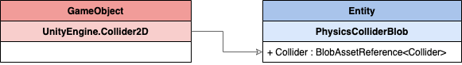

# GameObject conversions

When working with DOTs, GameObjects located inside SubScenes are converted into their ECS counterparts. This converted data is used during runtime in the DOTs systems. See [GameObject Conversion](https://docs.unity3d.com/Packages/com.unity.entities@0.14/manual/gp_overview.html#gameobject-conversion) for more details.

This page details the conversion of the properties and Assets in 2D Entities Physics for Rigidbody 2D and the different Collider 2D components.

## Rigidbody 2D

  Only properties with green check marks are converted over to the ECS environment.

| Property          | Conversion details                                           |
| ----------------- | ------------------------------------------------------------ |
| **Body Type**     | Different sets of components are added onto the final Entity depending on Body Type (see below for conversion charts for each type). |
| **Material**      | The Physics Material is copied over as is. If no Material is assigned, the default Physics Material is assigned and converted instead. |
| **Simulated**     | If this is not checked, the Rigidbody is not converted.      |
| **Mass**          | This value is inverted during conversion.                    |
| **Linear Drag**   | Copied over as is.                                           |
| **Angular Drag**  | Copied over as is.                                           |
| **Gravity Scale** | Copied over as is.                                           |

### Body Type: Dynamic

### Body Type: Kinematic

### Body Type: Static

A **Static** Rigidbody 2D does not generate any of the above components.

## Collider

The Collider data is converted and stored into a generic [Blob Asset](https://docs.unity3d.com/Packages/com.unity.entities@0.14/manual/ecs_components.html). The reference to the Blob Asset is then stored inside a `PhysicsColliderBlob` component. 

This component is added alongside the Entity that contains any converted Rigidbody 2D components. If there is no Rigidbody 2D then the component is added to the Entity related to the GameObject the Collider 2D is on.

Do note that if the Collider isn’t [Enabled](https://docs.unity3d.com/ScriptReference/Behaviour-enabled.html) or if its [usedByComposite](https://docs.unity3d.com/ScriptReference/Collider2D-usedByComposite.html) property is set to **True**, then it will not be converted to ECS.

The following Collider 2D types can be converted over to ECS:

- [Box Collider 2D](#box-collider-2d)
- [Capsule Collider 2D](#capsule-collider-2d)
- [Circle Collider 2D](#circle-collider-2d)
- [Polygon Collider 2D](#polygon-collider-2d)

**Note:** There is a current known limitation where multiple Collider 2Ds on the same GameObject will produce a warning from the GameObject conversion system as it does not support multiple components on the same Entity. This restriction will be removed in a future update.

### Box Collider 2D

 Only properties with green check marks are converted over to the ECS environment.

| Property              | Conversion details                                           |
| --------------------- | ------------------------------------------------------------ |
| **Material**          | The Physics Material is copied over as is. If no Material is assigned, then the Physics Material will be taken from Rigidbody 2D that owns this Collider instead. If the Rigidbody 2D also has no Material assigned, then the default Physics Material will be assigned. |
| **Is Trigger**        | Trigger status of the Physics Material is taken into account during conversion. |
| **Used By Composite** | If selected, the Collider is not converted.                  |
| **Offset**            | This is transformed into world space.                        |
| **Size**              | This value is multiplied with [transform.lossyScale](https://docs.unity3d.com/ScriptReference/Transform-lossyScale.html). |
| **Edge Radius**       | Copied over as is.                                           |

### Capsule Collider 2D

 Only properties with green check marks are converted over to the ECS environment.

| Property       | Conversion details                                           |
| -------------- | ------------------------------------------------------------ |
| **Material**   | The Physics Material is copied over as is. If no Material is assigned, then the Physics Material will be taken from Rigidbody 2D that owns this Collider instead. If the Rigidbody 2D also has no Material assigned, then the default Physics Material will be assigned. |
| **Is Trigger** | Trigger status of the Physics Material is taken into account during conversion. |
| **Offset**     | This is transformed into world space.                        |
| **Size**       | This value is multiplied with [transform.lossyScale](https://docs.unity3d.com/ScriptReference/Transform-lossyScale.html). |
| **Direction**  | This is used to build the Collider mesh only. It is not included in the final converted data. |

### Circle Collider 2D

 Only properties with green check marks are converted over to the ECS environment.

| Property       | Conversion details                                           |
| -------------- | ------------------------------------------------------------ |
| **Material**   | The Physics Material is copied over as is. If no Material is assigned, then the Physics Material will be taken from Rigidbody 2D that owns this Collider instead. If the Rigidbody 2D also has no Material assigned, then the default Physics Material will be assigned. |
| **Is Trigger** | Trigger status is taken into account by the Physics Material during conversion. |
| **Offset**     | Offset is transformed into world space.                      |
| **Radius**     | Radius is multiplied with [transform.lossyScale](https://docs.unity3d.com/ScriptReference/Transform-lossyScale.html). |

### Polygon Collider 2D

 Only properties with green check marks are converted over to the ECS environment.

| Property              | Conversion details                                           |
| --------------------- | ------------------------------------------------------------ |
| **Material**          | The Physics Material is copied over as is. If no Material is assigned, then the Physics Material will be taken from Rigidbody 2D that owns this Collider instead. If the Rigidbody 2D also has no Material assigned, then the default Physics Material will be assigned. |
| **Is Trigger**        | Trigger status is taken into account by the Physics Material during conversion. |
| **Used By Composite** | If selected, the Collider is **not** converted.              |
| **Offset**            | Offset is transformed into world space.                      |
| **Points**            | In classic Unity, Polygon Collider 2D converts an arbitrary outline into multiple primitive convex polygon shapes which themselves are limited in their number of vertices (8). ECS currently does not support the generation of a primitive 2D polygon mesh. For now, the Physics Polygon primitive supports up to 16 vertices which must form a convex polygon. When the Polygon Collider 2D is converted, only the first path is converted and only if it has 16 vertices or less. |

### Compound Collider

The ECS system has a hard limitation that only a single component of any type can be on an Entity. When adding multiple Collider 2D components either on the same GameObject or on its children GameObjects, the physics system will convert and combine them into a single compound Collider that contains all the Colliders. This produces a single [BlobAssetReference<Collider>](https://docs.unity3d.com/Packages/com.unity.entities@0.14/manual/ecs_components.html) as outlined above.